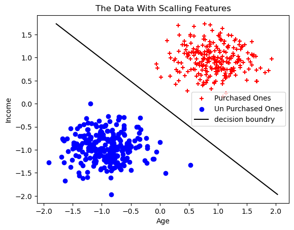

# 🧠 Logistic Regression from Scratch – Purchase Prediction (No Noise)

This project implements logistic regression from scratch using only NumPy and Matplotlib.

## 📊 Dataset

- `Age`, `Income`, `Purchased`
- File: `logistic-regression-purchase-prediction_no-noise.csv`

## ⚙️ Features

- Z-score feature scaling
- Binary logistic regression
- Gradient descent optimization
- Decision boundary visualization
- 100% accuracy (no-noise dataset)

## 🖼️ Visualization



## ▶️ Run the Project

```bash
python code.py
